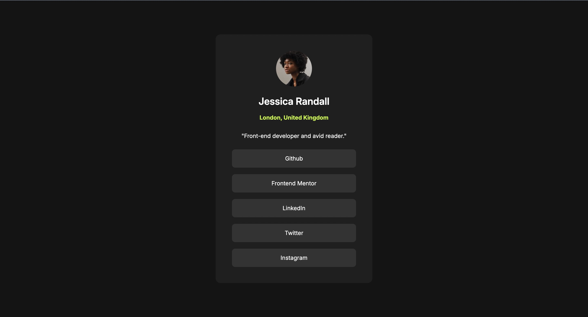

# Frontend Mentor - Social links profile solution

This is a solution to the [Social links profile challenge on Frontend Mentor](https://www.frontendmentor.io/challenges/social-links-profile-UG32l9m6dQ). Frontend Mentor challenges help you improve your coding skills by building realistic projects. 

## Table of contents

- [Overview](#overview)
  - [The challenge](#the-challenge)
  - [Screenshot](#screenshot)
  - [Links](#links)
- [My process](#my-process)
  - [Built with](#built-with)
  - [What I learned](#what-i-learned)
  - [Continued development](#continued-development)
  - [Author](#author)

## Overview

### The challenge

Users should be able to:

- See hover and focus states for all interactive elements on the page

### Screenshot

### Links

- Solution URL:(https://github.com/nathan-bark/social-links-profile-main)
- Live Site URL:(https://nathan-bark.github.io/social-links-profile-main/)

## My process

I start from the layout of the bigger parts then work towards the smaller details, add the colours and font styles, then fine tune.

### Built with

- Semantic HTML5 markup
- SASS/CSS
- Flexbox
- Mobile-first workflow

### What I learned

How to effectively use SASS variables, mixins and placeholders to avoid repetition and readability in css.

### Continued development

Continue practising nesting logic and when to use mixins or placeholders in SASS.

## Author

- Website - (https://nathan-bark.netlify.app/)
- Frontend Mentor - (https://www.frontendmentor.io/profile/nathan-bark)
- Github - (https://github.com/nathan-bark)

